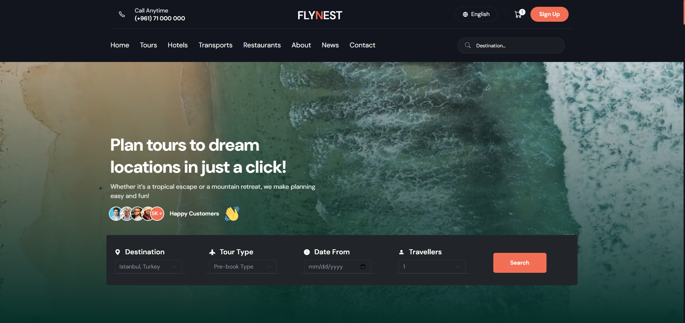

# 🛫 Flynest Travel Booking



A modern, responsive travel booking platform built with React and Vite, offering comprehensive travel services including tours, hotels, transportation, and restaurants.

## 🔗 Live Demo

👉 [View Deployed App](https://Rola-Al-Ahmad.github.io/Flynest_Travel_booking_RJ)

---

## 📋 Table of Contents

- [Project Overview](#-project-overview)
- [Features](#-features)
- [Tech Stack](#-tech-stack)
- [Project Structure](#-project-structure)
- [Getting Started](#-getting-started)
- [Available Scripts](#-available-scripts)
- [Key Features](#-key-features)
- [Components Overview](#-components-overview)
- [Data Structure](#-data-structure)
- [Routing](#-routing)
- [Styling](#-styling)
- [Contributing](#-contributing)

## 🧠 Project Overview

Flynest is a **full-featured travel booking platform** where users can discover tours, hotels, restaurants, and transportation options, add them to a cart, and complete a **secure, multi-step checkout** flow.  
The project showcases a **feature-based React architecture** using **React Router** for page navigation, **Context API** for cart and booking state, and **JSON-driven data** for all travel content.  
Its primary learning goals are to demonstrate **modern SPA patterns** (routing, layouts, protected pages), **form handling and validation**, **PDF invoice generation**, and a **production‑style UX** with toasts, loading states, and error handling.

## ✨ Features

### 🎯 Core Functionality

- **Multi-service Booking**: Tours, Hotels, Transportation, and Restaurants
- **Interactive Tour Details**: Comprehensive tour information with booking capabilities
- **Shopping Cart System**: Full cart management with item tracking
- **Checkout Process**: Multi-step checkout with payment integration
- **Booking Confirmation**: PDF invoice generation and booking summaries
- **Responsive Design**: Mobile-first approach with Bootstrap 5

### 🎨 User Experience

- **Modern UI/UX**: Clean, intuitive interface with smooth animations
- **Error Handling**: Comprehensive error pages for various scenarios
- **Loading States**: Optimized user experience with proper loading indicators
- **Toast Notifications**: User feedback with react-toastify
- **Form Validation**: Robust form handling with Formik and Yup

### 🔧 Technical Features

- **Context API**: State management for cart and booking data
- **Protected Routes**: Secure checkout and payment flows
- **PDF Generation**: Invoice and booking confirmation documents
- **Image Optimization**: Optimized image handling and lazy loading
- **SEO Friendly**: Proper meta tags and semantic HTML

## 🛠 Tech Stack

### Frontend

- **React 19.1.0** - Modern React with latest features
- **Vite 6.3.5** - Fast build tool and development server
- **React Router DOM 7.6.2** - Client-side routing
- **Bootstrap 5.3.7** - CSS framework for responsive design
- **React Bootstrap 2.10.10** - Bootstrap components for React

### Form & Validation

- **Formik 2.4.6** - Form state management
- **Yup 1.6.1** - Schema validation

### UI & Animation

- **Lucide React 0.534.0** - Modern icon library
- **Animate.css 4.1.1** - CSS animation library
- **Swiper 11.2.8** - Touch slider component
- **React Toastify 11.0.5** - Toast notifications

### PDF & File Handling

- **React PDF 10.0.1** - PDF viewing capabilities
- **@react-pdf/renderer 4.3.0** - PDF generation
- **File Saver 2.0.5** - File download functionality

### Development Tools

- **ESLint 9.25.0** - Code linting
- **TypeScript Support** - Type definitions for React

## 📁 Project Structure

```
Flynest_Travel_booking_RJ/
├── public/
│   ├── Images/          # Static images for tours, hotels, etc.
│   └── logos/           # Payment method logos
├── src/
│   ├── assets/          # Application assets and images
│   ├── Data/            # JSON data files
│   │   ├── Hotel.json
│   │   ├── Restaurant.json
│   │   ├── Tours.json
│   │   └── Transport.json
│   ├── features/        # Feature-based components
│   │   ├── About/       # About page components
│   │   ├── Blog/        # Blog and news components
│   │   ├── BookingSummary/ # Booking confirmation
│   │   ├── Cart/        # Shopping cart functionality
│   │   ├── CheckOut/    # Checkout process
│   │   ├── Contact/     # Contact page
│   │   ├── Footer/      # Footer components
│   │   ├── Home/        # Homepage components
│   │   ├── ListingPage/ # Service listing pages
│   │   ├── Navbar/      # Navigation components
│   │   ├── Payment/     # Payment processing
│   │   ├── Tour/        # Tour components
│   │   └── TourDetails/ # Tour detail pages
│   ├── layouts/         # Layout components
│   ├── shared/          # Shared components and utilities
│   ├── App.jsx          # Main application component
│   ├── main.jsx         # Application entry point
│   └── index.css        # Global styles
├── package.json
├── vite.config.js
└── README.md
```

## 🚀 Getting Started

### Prerequisites

- Node.js (version 16 or higher)
- npm or yarn package manager

### Installation

1. **Clone the repository**

   ```bash
   git clone <repository-url>
   cd Flynest_Travel_booking_RJ
   ```

2. **Install dependencies**

   ```bash
   npm install
   ```

3. **Start development server**

   ```bash
   npm run dev
   ```

4. **Open your browser**
   Navigate to `http://localhost:5173` to view the application

## 📜 Available Scripts

| Script            | Description                           |
| ----------------- | ------------------------------------- |
| `npm run dev`     | Starts the development server         |
| `npm run build`   | Builds the app for production         |
| `npm run lint`    | Runs ESLint to check code quality     |
| `npm run preview` | Previews the production build locally |

## 🎯 Key Features

### 🏠 Homepage

- **Hero Section**: Eye-catching banner with search functionality
- **Tour Showcase**: Featured tours with booking options
- **Destination Gallery**: Popular destinations with images
- **Explore Section**: Interactive content tabs
- **Testimonials**: Customer reviews and feedback
- **Brand Section**: Partner logos and trust indicators
- **Blog Section**: Latest travel news and articles
- **Pricing**: Service pricing information

### 🛒 Shopping Cart

- **Cart Management**: Add/remove items, quantity updates
- **Price Calculation**: Real-time total calculation
- **Item Filtering**: Filter cart items by category
- **Empty State**: User-friendly empty cart experience

### 💳 Checkout Process

- **Multi-step Form**: Personal details, tour selection, payment
- **Form Validation**: Comprehensive input validation
- **Protected Routes**: Secure checkout flow
- **Booking Summary**: Order review before payment

### 🎫 Tour Details

- **Tour Information**: Comprehensive tour details
- **Image Gallery**: Tour photos and videos
- **Booking Widget**: Real-time availability and pricing
- **Tour Plan**: Detailed itinerary information
- **Inclusions/Exclusions**: What's included in the tour
- **Policies**: Cancellation and booking policies

### 📄 Booking Confirmation

- **Invoice Generation**: PDF invoice creation
- **Booking Summary**: Complete booking details
- **Download Options**: PDF download functionality

## 🧩 Components Overview

### Layout Components

- **RootLayout**: Main application layout with navigation
- **CartLayout**: Shopping cart specific layout
- **ListingLayout**: Service listing pages layout

### Feature Components

- **Hero**: Landing page hero section with search
- **TourCard**: Individual tour display component
- **CartTable**: Shopping cart item display
- **PaymentForm**: Payment processing forms
- **BookingDetails**: Order summary display

### Shared Components

- **NotFound**: Error page component with multiple error types
- **PageBreadcrumb**: Navigation breadcrumbs
- **SectionTitle**: Reusable section headers

## 📊 Data Structure

The application uses JSON files for data management:

### Tours.json

- Tour details, pricing, images, descriptions
- Availability and booking information
- Tour categories and tags

### Hotel.json

- Hotel listings with amenities
- Room types and pricing
- Location and contact information

### Restaurant.json

- Restaurant listings and menus
- Cuisine types and ratings
- Location and booking information

### Transport.json

- Transportation options
- Routes and schedules
- Pricing and booking details

## 🛣 Routing

The application uses React Router with the following structure:

```
/                   # Homepage
/about              # About page
/contact            # Contact page
/news               # Blog/News page
/tours/:id          # Individual tour details
/tours              # Tours listing page
/hotels             # Hotels listing page
/transports         # Transportation listing page
/restaurants        # Restaurants listing page
/cart               # Shopping cart
/cart/checkout      # Checkout process
/cart/payment       # Payment processing
/cart/bookingSummary # Booking confirmation
/*                  # 404 Not Found page
```

## 🎨 Styling

### CSS Framework

- **Bootstrap 5**: Primary styling framework
- **Custom CSS**: Component-specific styles
- **CSS Variables**: Consistent theming

### Design System

- **Color Palette**: Primary, secondary, and accent colors
- **Typography**: Custom fonts (Kaushan, Lora)
- **Spacing**: Consistent margin and padding system
- **Components**: Reusable UI components

### Responsive Design

- **Mobile-first**: Optimized for mobile devices
- **Breakpoints**: Bootstrap responsive breakpoints
- **Flexible Layouts**: Adaptive component layouts

## 🤝 Contributing

1. Fork the repository
2. Create a feature branch (`git checkout -b feature/amazing-feature`)
3. Commit your changes (`git commit -m 'Add some amazing feature'`)
4. Push to the branch (`git push origin feature/amazing-feature`)
5. Open a Pull Request

### Code Style

- Follow ESLint configuration
- Use meaningful component and variable names
- Add comments for complex logic
- Maintain consistent code formatting

## 📝 License

This project is licensed under the MIT License - see the LICENSE file for details.

## 🙏 Acknowledgments

- **Bootstrap Team**: For the excellent CSS framework
- **React Community**: For the amazing ecosystem
- **Vite Team**: For the fast build tool
- **All Contributors**: For their valuable contributions

---

**Flynest Travel Booking** - Making travel dreams come true, one booking at a time! ✈️🌍
